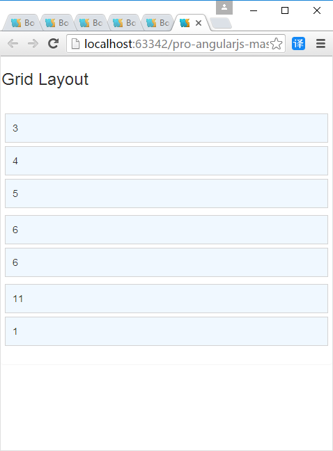

# Bootstrap CSS
## 1.关于Bootstrap
 Bootstrap 是一个目前广泛流行的CSS框架（CSS框架是用于综合的帮助Web应用开发者以简单而统一的方式渲染文档内容的）。Bootstrap包含一系列可用于对元素提供统一样式的CSS类，以及一些可用于执行 额外的增强功能的JavaScrap代码。   
 
 **例2-1**：   
```
<!DOCTYPE html>
<html xmlns="http://www.w3.org/1999/xhtml">
<head>
    <title>Bootstrap Examples</title>
    <link href="bootstrap.css" rel="stylesheet" />
    <link href="bootstrap-theme.css" rel="stylesheet" />
</head>
<body>
    <div class="panel">
        <h3 class="panel-heading">Button Styles</h3>
        <button class="btn">Basic Button</button>
        <button class="btn btn-primary">Primary</button>
        <button class="btn btn-success">Success</button>
        <button class="btn btn-warning">Warning</button>
        <button class="btn btn-info">Info</button>
        <button class="btn btn-danger">Danger</button>
    </div>
    <div class="well">        
        <h3 class="panel-heading">Button Sizes</h3>        
        <button class="btn btn-lg btn-success">Large Success</button>
        <button class="btn btn-warning">Standard Warning</button>
        <button class="btn btn-sm btn-danger">Small Danger</button>
    </div>
    <div class="well">        
        <h3 class="panel-heading">Block Buttons</h3>
        <button class="btn btn-block btn-lg btn-success">Large Block Success</button>
        <button class="btn btn-block btn-warning">Standard Block Warning</button>
        <button class="btn btn-block btn-sm btn-info">Small Block Info</button>
    </div>
</body>
</html>
```    
  
 
这个示例演示了一些Bootstrap不同的特性。   

## 2.使用基本的Bootstrap类   
Bootstrap样式是通过class实行使用的。例子中使用了'panel'属性，这是Bootstrap所定义的众多CSS类之一。当我们把class属性设置为Bootstrap类的名字时，Bootstrap所定义的CSS样式就会被使用。   
### 2.1修改样式上下文   
Bootstrap定义了一组可应用到元素上的样式上下文类，用来表示其目的。   

**例2-2：**   
```
<button class="btn btn-primary">Primary</button>
```   
将基础Bootstrap样式类的名字（比如btn），一个连字符和primary、success、warning、info或danger这些词之一联合在一起。上下文类必须和基础类一起使用如例2-2所示。
### 2.2修改大小   
你可以通过使用大小修改类来改变某些元素被渲染样式的方式。将一个基础类的名字，一个连字符和lg或sm之一联合在一起，如例2-3。  
 
**例2-3：**   
```
<button class="btn btn-large btn-success">Large Success</button>
```   
省略大小修改类将使用元素的默认大小。注意我们可以联合使用上下文类和大小修改类。Bootstrap类的修改可以一起工作。如例2-4所示，可使用`btn-block`类来创建一个能够填满合适的横向空间的按钮。  
 
**例2-4：**   
```
<button class="btn btn-block btn-large btn-success">Large Block Success</button>
```   
## 3.用Bootstrap对表格使用样式   
表2-1列出了Bootstrap所包含的对表格的CSS类。   

**表2-1：**   

| Bootstrap类 | 描述 |
| -----|:----:|
| table    | 对table元素及其内容使用一般样式    |
| table-striped    | 对table的主体部分使用隔行条纹式的样式    |
| table-bordered    | 对所有行和列使用边框    |
| table-hover    | 当鼠标滑过一行时显示不同样式    |
| table-condensed    | 减少表格中的空白以创建更精简的布局    |   


**例2-5：**   
```
<!DOCTYPE html>
<html xmlns="http://www.w3.org/1999/xhtml">
<head>
    <title>Bootstrap Examples</title>
    <link href="bootstrap.css" rel="stylesheet" />
    <link href="bootstrap-theme.css" rel="stylesheet" />
</head>
<body>
    <div class="panel">
        <h3 class="panel-heading">Standard Table with Context</h3>
        <table class="table">
            <thead>
                <tr><th>Country</th><th>Capital City</th></tr>
            </thead>
            <tr class="success"><td>United Kingdom</td><td>London</td></tr>
            <tr class="danger"><td>France</td><td>Paris</td></tr>
            <tr><td>Spain</td><td class="warning">Madrid</td></tr>
        </table>
    </div>
    <div class="panel">
        <h3 class="panel-heading">Striped, Bordered and Highlighted Table</h3>
        <table class="table table-striped table-bordered table-hover">
            <thead>
                <tr><th>Country</th><th>Capital City</th></tr>
            </thead>
            <tr><td>United Kingdom</td><td>London</td></tr>
            <tr><td>France</td><td>Paris</td></tr>
            <tr><td>Spain</td><td>Madrid</td></tr>
        </table>
    </div>
</body>
</html>
```
    

使用时应注意确保表格结构正确。   
在例2-5中，我们使用了`thead`元素，如果没有使用`tboy`元素，那么浏览器会自动将`table`元素下的任何直接的`tr`子元素添加到`tboy`元素下。如果在使用Bootstrap时依赖于这个行为，你就会得到一些奇怪的结果，因为应用于`table`元素的大多数CSS类会导致样式被添加到`tbody`元素的子元素上。

**例2-6：**   
```
<!DOCTYPE html>
<html xmlns="http://www.w3.org/1999/xhtml">
<head>
    <title>Bootstrap Examples</title>
    <link href="bootstrap.css" rel="stylesheet" />
    <link href="bootstrap-theme.css" rel="stylesheet" />
</head>
<body>
    <div class="panel">
        <h3 class="panel-heading">Striped, Bordered and Highlighted Table</h3>
        <table class="table table-striped table-bordered table-hover">
            <tr><th>Country</th><th>Capital City</th></tr>
            <tr><td>United Kingdom</td><td>London</td></tr>
            <tr><td>France</td><td>Paris</td></tr>
            <tr><td>Spain</td><td>Madrid</td></tr>
        </table>
    </div>
</body>
</html>

```   
  
   
如例2-6所示，这个`table`没有`thead`元素，所以表头行被添加到自动创建的`tbody`元素下。表格行的带状效果现在从表头就开始了，在鼠标滑过表头行时，你会发现表头行被包含在高亮的效果中。一般来说这不是想要的效果，因为这会让用户感到困惑。   

## 4.使用Bootstrap创建表单   
**例2-7：**   
```
<!DOCTYPE html>
<html xmlns="http://www.w3.org/1999/xhtml">
<head>
    <title>Bootstrap Examples</title>
    <link href="bootstrap.css" rel="stylesheet" />
    <link href="bootstrap-theme.css" rel="stylesheet" />
</head>
<body>
    <div class="panel">
        <h3 class="panel-header">
            Form Elements
        </h3>

        <div class="form-group">
            <label>Name:</label>
            <input name="name" class="form-control" />
        </div>

        <div class="form-group">
            <label>Email:</label>
            <input name="email" class="form-control" />
        </div>

        <div class="radio">
            <label>
                <input type="radio" name="junkmail" value="yes" checked />
                Yes, send me endless junk mail
            </label>
        </div>
        <div class="radio">
            <label>
                <input type="radio" name="junkmail" value="no" />
                No, I never want to hear from you again
            </label>
        </div>

        <div class="checkbox">
            <label>
                <input type="checkbox" />
                I agree to the terms and conditions.
            </label>
        </div>

        <input type="button" class="btn btn-primary" value="Subscribe" />
    </div>
</body>
</html>
```   
     

如例2-7所示，对一个包含了`label`和一个`input`元素的`div`元素使用`form-group`类，可以应用可用于表单的基本样式。对于其他表单元素有不同的类，在本例中，使用了`checkbox`类，也应用到了`div`元素上。   
## 5.使用Bootstrap创建网格   
Bootstrap提供了可用于创建不同种类的网格布局的样式类，可含有1到12列，并提供对响应式布局（网格的布局可根据屏幕宽度变化，允许同样的内容在移动和桌面设备上进行展示）的支持。   
**例2-8：**   
```
<!DOCTYPE html>
<html xmlns="http://www.w3.org/1999/xhtml">
<head>
    <title>Bootstrap Examples</title>
    <link href="bootstrap.css" rel="stylesheet" />
    <link href="bootstrap-theme.css" rel="stylesheet" />
    <style>
        #gridContainer {padding: 20px;}
        .grid-row > div { border: 1px solid lightgrey; padding: 10px;
                          background-color: aliceblue; margin: 5px 0; }
    </style>
</head>
<body>
    <div class="panel">

        <h3 class="panel-header">
            Grid Layout
        </h3>

        <div id="gridContainer">

            <div class="row grid-row">
                <div class="col-xs-1">1</div>
                <div class="col-xs-1">1</div>
                <div class="col-xs-2">2</div>
                <div class="col-xs-2">2</div>
                <div class="col-xs-6">6</div>
            </div>

            <div class="row grid-row">
                <div class="col-xs-3">3</div>
                <div class="col-xs-4">4</div>
                <div class="col-xs-5">5</div>
            </div>

            <div class="row grid-row">
                <div class="col-xs-6">6</div>
                <div class="col-xs-6">6</div>
            </div>

            <div class="row grid-row">
                <div class="col-xs-11">11</div>
                <div class="col-xs-1">1</div>
            </div>

            <div class="row grid-row">
                <div class="col-xs-12">12</div>
            </div>
        </div>
    </div>
</body>
</html>
```   
    

例2-8无响应式功能，例2-9为响应式网格。

**例2-9：**   
```
<!DOCTYPE html>
<html xmlns="http://www.w3.org/1999/xhtml">
<head>
    <title>Bootstrap Examples</title>
    <meta name="viewport" content="width=device-width, initial-scale=1">
    <link href="bootstrap.css" rel="stylesheet" />
    <link href="bootstrap-theme.css" rel="stylesheet" />
    <style>
        #gridContainer { padding: 20px; }
        .grid-row > div { border: 1px solid lightgrey;
                          padding: 10px; background-color: aliceblue; margin: 5px 0; }
    </style>
</head>
<body>
    <div class="panel">

        <h3 class="panel-header">
            Grid Layout
        </h3>
        <div id="gridContainer">

            <div class="row grid-row">
                <div class="col-sm-3">3</div>
                <div class="col-sm-4">4</div>
                <div class="col-sm-5">5</div>
            </div>

            <div class="row grid-row">
                <div class="col-sm-6">6</div>
                <div class="col-sm-6">6</div>
            </div>

            <div class="row grid-row">
                <div class="col-sm-11">11</div>
                <div class="col-sm-1">1</div>
            </div>

        </div>
    </div>
</body>
</html>
```   
    

注意，例2-9中使用了一个`meta`元素，这个元素告诉移动浏览器要显示内容的实际大小。没有这个元素，许多移动浏览器将按照为桌面设备设计的那样显示内容，等用户放大才能看到细节内容。简而言之，当以移动设备为目标时，你应当总是加上一个类似于这个例子中的`meta`元素。
表2-2显示了用于响应式表格的Bootstrap CSS类。 
  
**表2-2 ：**   


| Bootstrap类 | 描述 |
| -----|:----:|
| col-sm-*    | 当屏幕宽度大于768像素时水平显示网格单元   |
|  col-md-*     | 当屏幕宽度大于940像素时水平显示网格单元    |
|  col-lg-*     | 当屏幕宽度大于1170像素时水平显示网格单元    |
