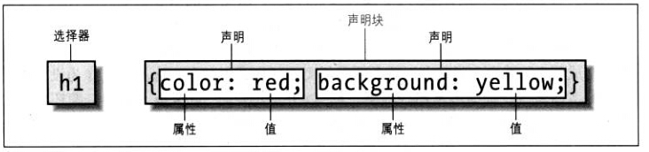

# css优先级计算规则
## 特殊性
&#8194;&#8194;&#8194;&#8194;CSS继承是从一个元素向其后代元素传递属性值所采用的机制。确定应当向一个元素应用哪些值时，浏览器不仅要考虑继承，还要考虑声明的特殊性，另外需要考虑声明本身的来源。这个过程就称为层叠。——《css权威指南》  

&#8194;&#8194;&#8194;&#8194;上面这句话有两个词需要稍作解释，“声明”和“特殊性”。如下图，css规则由选择器和声明块组成，写在选择器后面大括号里的就叫声明。   
  

&#8194;&#8194;&#8194;&#8194;实际上，同一个元素可以使用多个规则来指定它的字体颜色，每个规则都有自己的选择器。显然最终只有一个规则起作用（不可能一个字既是红色又是绿色），那么该规则的特殊性最高，特殊性即css优先级。很多同学仅仅知道选择器优先级ID>class>元素选择器，而不知道ID的优先级为什么大于class的优先级。那么css优先级到底是怎么计算的呢？   
### 特殊性分类    
&#8194;&#8194;&#8194;&#8194;选择器的特殊性值表述为4个部分，用0,0,0,0表示。
1. 内联样式的特殊性值,加1,0,0,0。    
2. ID选择器的特殊性值，加0,1,0,0。  
3. 类选择器、属性选择器或伪类，加0,0,1,0。   
4. 元素和伪元素，加0,0,0,1。
5. 通配选择器*，子选择器（>）和相邻同胞选择器（+）对特殊性没有贡献,即0,0,0,0。
6. 比较特殊的一个标志!important（权重），它没有特殊性值，但它的优先级是最高的，为了方便记忆，可以认为它的特殊性值为1,0,0,0,0。

###### 易混淆    
&#8194;&#8194;&#8194;&#8194;伪类(:link,:hover,:active,:visited,:focus,:first-child,:first,:left,:right,:lang)    

&#8194;&#8194;&#8194;&#8194;伪元素(:first-letter,:first-line,:before,:after)
#### 例子    
```css
1 a{color: yellow;} /*特殊性值：0,0,0,1*/
2 div a{color: green;} /*特殊性值：0,0,0,2*/
3 .demo a{color: black;} /*特殊性值：0,0,1,1*/
4 .demo input[type="text"]{color: blue;} /*特殊性值：0,0,2,1*/
5 .demo *[type="text"]{color: grey;} /*特殊性值：0,0,2,0*/
6 #demo a{color: orange;} /*特殊性值：0,1,0,1*/
7 div#demo a{color: red;} /*特殊性值：0,1,0,2*/
```    
&#8194;&#8194;&#8194;&#8194;分析上面的demo，要注意特殊性是怎么排序的，上面第4行和第5行规则，第4行之所以优先级比第5行高，是因为第四行特殊性值最后面是1，而第5行特殊性值最后面是0。回过头来回答文章最开始的问题，为什么ID选择器的优先级比类选择器的优先级高？实际上是因为选择器特殊性值是从左向右排序的，特殊性值1,0,0,0大于以0开头的所有特殊性值，即便它是0,99,99,99，优先级依然比1,0,0,0要低。     

### 补充
&#8194;&#8194;&#8194;&#8194;通配选择器*的特殊性值是0,0,0,0，而元素通过父元素继承过来的样式是没有特殊性值的，所以，通配选择器定义的规则优先级高于元素继承过来的规则的优先级

### 层叠

&#8194;&#8194;&#8194;&#8194;假如特殊性相同的两条规则应用到同一个元素会怎样？css会先查看规则的权重（!important），加了权重的优先级最高，当权重相同的时候，会比较规则的特殊性，根据前面的优先级计算规则决定哪条规则起作用，当特殊性值也一样的时候，css规则会按顺序排序，后声明的规则优先级高，成为人生赢家，当上总经理出任CEO迎娶白富美。
